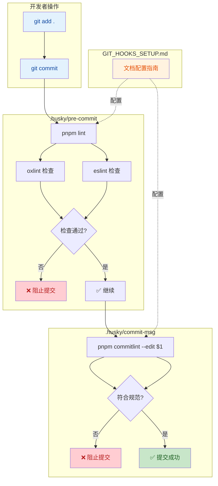

# Git Hooks 设置文档

本文档记录了为项目添加git hooks的操作过程，实现了代码审查和提交规范检查功能。

## 操作步骤

### 1. 检查项目结构和现有git配置

首先检查项目的基本结构和git配置情况：

```bash
# 查看项目目录结构
ls -la

# 检查git状态
git status
```

### 2. 安装husky作为git hooks工具

```bash
# 安装husky
pnpm add -D husky

# 初始化husky
pnpm husky init
```

### 3. 配置提交规范检查（commitlint）

```bash
# 安装commitlint及其相关依赖
pnpm add -D @commitlint/cli @commitlint/config-conventional

# 创建commitlint配置文件
touch commitlint.config.ts
```

commitlint.config.ts配置内容：

```typescript
import type { UserConfig } from '@commitlint/types'

export default {
  extends: ['@commitlint/config-conventional'],
} satisfies UserConfig
```

### 4. 设置git hooks触发机制

#### 4.1 修改pre-commit钩子

编辑 `.husky/pre-commit` 文件，将默认的测试命令改为代码审查命令：

```bash
# 原内容
pnpm test

# 修改为
pnpm lint
```

#### 4.2 添加commit-msg钩子

```bash
# 创建commit-msg钩子文件
touch .husky/commit-msg

# 添加执行权限
chmod +x .husky/commit-msg
```

commit-msg钩子内容：

```bash
pnpm commitlint --edit $1
```

### 5. 测试git hooks配置

#### 5.1 测试提交规范检查

```bash
# 尝试使用不符合规范的提交消息（应该被拒绝）
git add . && git commit -m "add test files"

# 使用符合规范的提交消息（应该成功）
git add . && git commit -m "test: update test files"
```

#### 5.2 测试代码审查

创建包含linting错误的文件，然后尝试提交，检查pre-commit钩子是否会执行代码审查。

## 配置说明

### 代码审查工具

项目使用以下代码审查工具：

- **eslint**：JavaScript/TypeScript代码检查
- **oxlint**：高性能代码检查工具

代码审查命令：`pnpm lint`，会执行以下操作：

- `pnpm lint:oxlint`：运行oxlint进行代码检查
- `pnpm lint:eslint`：运行eslint进行代码检查

### 提交规范

使用 **commitlint** 检查提交消息是否符合 **conventional commit** 规范。

提交消息格式：

```
<type>: <subject>

<body>

<footer>
```

常用type：

- feat: 新功能
- fix: 修复bug
- docs: 文档更新
- style: 代码风格调整
- refactor: 代码重构
- test: 测试相关
- chore: 构建或依赖更新

## 注意事项

1. 确保所有开发者在克隆项目后运行 `pnpm install` 来安装依赖，包括husky和commitlint
2. 如果遇到husky相关的警告，如 `~/.huskyrc is DEPRECATED`，可以忽略，不影响功能
3. 提交代码前确保代码符合项目的代码规范，否则pre-commit钩子会阻止提交
4. 提交消息必须符合conventional commit规范，否则commit-msg钩子会阻止提交

<br />


